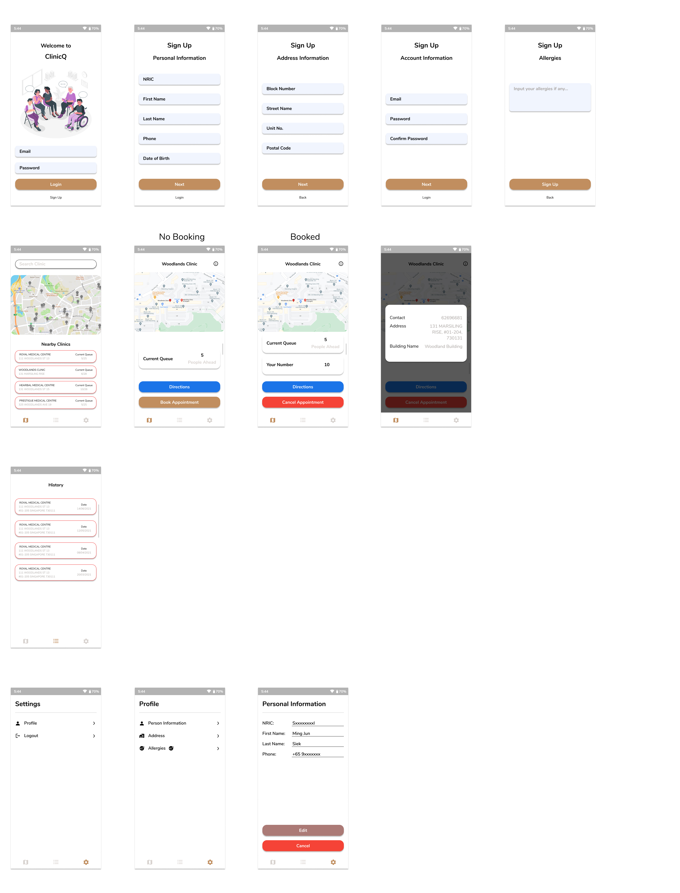

# DSTA BRAINHACK 2021 - Clinic_Q

Click [here](https://www.youtube.com/watch?v=TKXiXZyXiDk) to see a demo of our App. 

## Project Inspiration
This project aims to provide a solution to a post-covid world. In the current Covid-19 
pandemic, it has taught us the importance of social distancing to protect one-self from 
any sickness. This practice should not only be applied in such times, but it should be
extended to keep everyone safe. This solution has been adopted by the polyclinics in Singapore,
however, it has not been made available to the private clinics.

Therefore, we came up with the idea of providing a queuing system for any private clinic
that wishes to participate in it. This allows private clinics to register with us and allow
users to queue from the comfort of their homes and only come down slightly before their turns. 

## Libraries used
Clinic-Q is developed using Flutter framework using Dart Language.

Flutter is a framework that allows us to build native app on iOS and Android from a single codebase. Dart is the programming language used to code Flutter apps. It also provides various libraries that would help us in our development of this app.

Below is a list of libraries used for this app.
- Google Maps: Allow users to search for clinics nearby
- Location: Locate users location
- Firebase: Database

## Screenshot of Clinic-Q

This is done during our brainstorming phrase during our Hackathon. We made some changes as we proceed
further into the competition. However, this prototype provides a good overview of the app. 

## Contributors
- [Siek Ming Jun](https://github.com/mingjunsiek)
- [Poh Ying Xuan](https://github.com/seanpohyx)
- [Samuel Tan](https://github.com/yong-an)
- [Hoo Bing Yuan](https://github.com/biscuithoo)